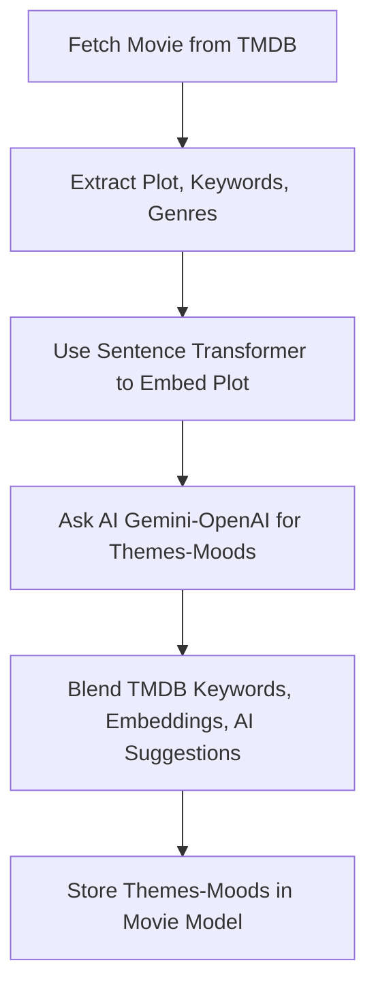

# movie-app



```mermaid
flowchart TD
    A[Fetch Movie from TMDB] --> B[Extract Plot, Keywords, Genres]
    B --> C[Use Sentence Transformer to Embed Plot]
    C --> D[Ask AI for Themes & Moods\n(Gemini or OpenAI)]
    D --> E[Blend TMDB Keywords, Embeddings, AI Suggestions]
    E --> F[Store Themes & Moods in Movie Model]
```
