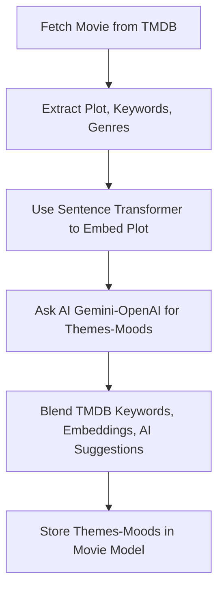
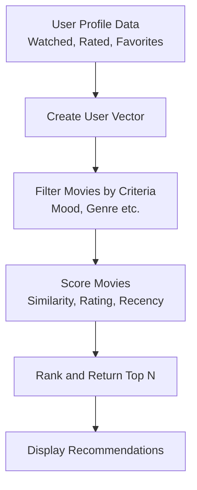

# movie-app

```mermaid
flowchart TD
    A[Fetch Movie from TMDB] --> B[Extract Plot, Keywords, Genres]
    B --> C[Use Sentence Transformer to Embed Plot]
    C --> D[Ask AI Gemini-OpenAI for Themes-Moods]
    D --> E[Blend TMDB Keywords, Embeddings, AI Suggestions]
    E --> F[Store Themes-Moods in Movie Model]
```

```mermaid
flowchart TD
    A[User Profile Data\nWatched, Rated, Favorites] --> B[Create User Vector]
    B --> C[Filter Movies by Criteria\nMood, Genre etc.]
    C --> D[Score Movies\nSimilarity, Rating, Recency]
    D --> E[Rank and Return Top N]
    E --> F[Display Recommendations]
```

