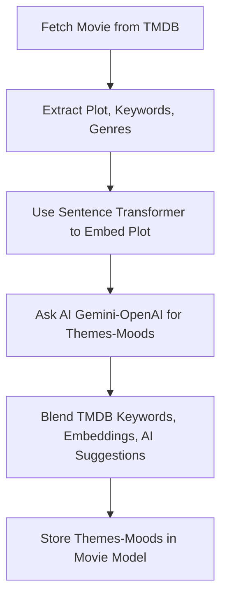
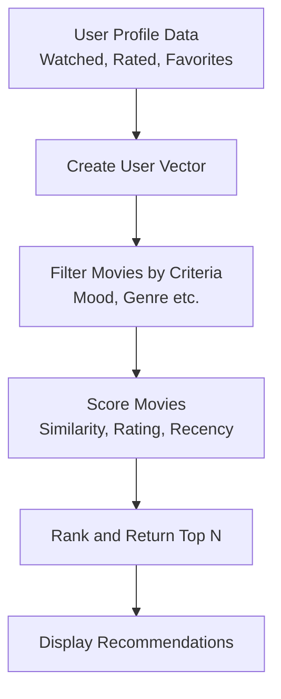

# movie-app

# 1. How to Build a Diverse, High-Quality Movie Catalog
# A. Source Movies from TMDB
Use TMDB’s “Discover” API to fetch movies by:
Popularity (top-rated, most popular)
Genres (drama, action, comedy, etc.)
Countries (US, UK, India, Japan, etc.)
Release Years (classics, recent, etc.)
Example: Fetch top 500 movies from each major genre, plus top 1000 by popularity, and blend them.
B. Filter for Quality and Diversity
Exclude low-rated movies (e.g., below 6.0 on TMDB).
Ensure diversity by sampling from different genres, countries, and years.
Avoid duplicates (some movies might appear in multiple lists).

# 2. Enriching Movies with Themes and Moods
A. How to Generate Themes and Moods
NLP/AI Hybrid Approach:
Use TMDB Keywords: TMDB provides keywords for each movie (e.g., “violence,” “friendship,” “betrayal”). These are a great starting point.
Use Plot Embeddings: Use a sentence transformer (e.g., sentence-transformers) to embed the movie’s plot. This captures semantic meaning.
Use AI (Gemini/OpenAI): For each movie, ask the AI to suggest 3–5 themes and 3–5 moods based on the plot, keywords, and genres.
Blend Results: Combine TMDB keywords, plot embeddings, and AI suggestions to get a rich set of themes and moods.
B. Example Workflow for Theme/Mood Generation

# 3. Script to Build and Enrich Your Catalog
A. Fetch Movies from TMDB
Use TMDB’s “Discover” API to fetch movies by genre, popularity, etc.
Store basic data (title, plot, genres, etc.) in your MongoDB.
B. Enrich with Themes and Moods
For each movie:
Extract TMDB keywords.
Embed the plot using a sentence transformer.
Ask AI for themes and moods.
Blend and store the results.

# Enriching with themes/moods:

NLP/AI processing adds time (a few seconds per movie).
Total time: a few hours (manageable on your i7 laptop).
# 5. How to Handle User-Input Moods
For predefined moods: Use your catalog and ML/NLP models to recommend movies.
For random/user-input moods: Use AI (Gemini/OpenAI) to generate a list of movies matching that mood, then score/rank them using your ML/NLP models.

 # 6. Scoring and Filtering Recommendations
 
For each block (TopGenres, EmotionalPicks, etc.):
Filter movies by the block’s criteria (genre, mood, etc.).
Score each movie based on:
Similarity to user’s profile (from watched/rated movies).
TMDB rating (if user prefers high-rated movies).
Recency (if user prefers recent movies).
Rank and return the top N movies.

# 7. Visual: Full Recommendation Flow

